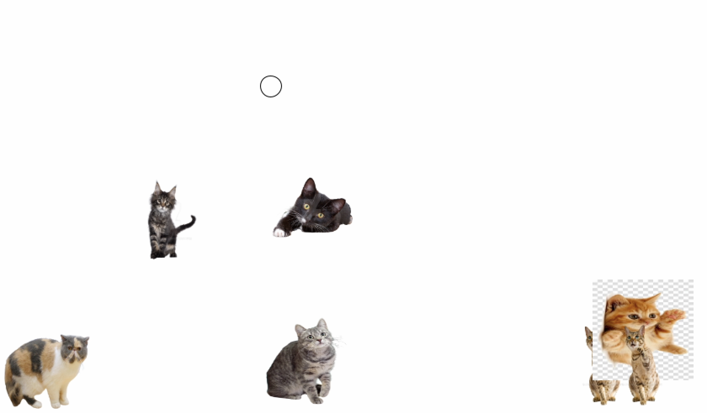
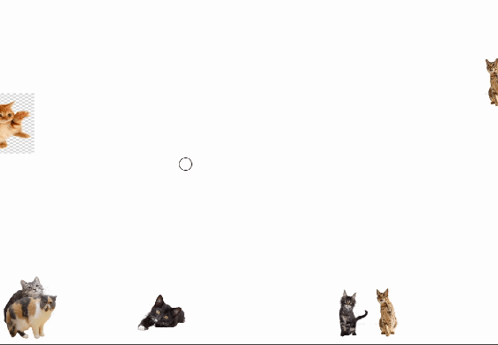
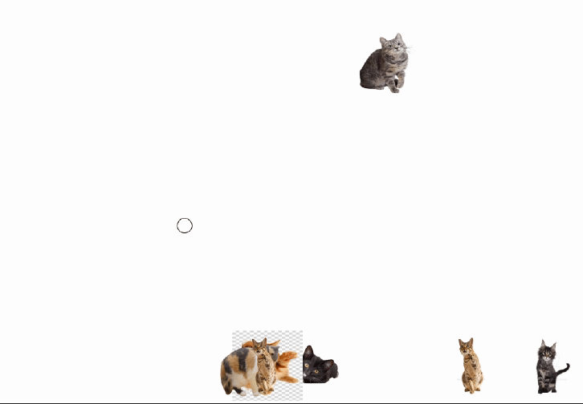
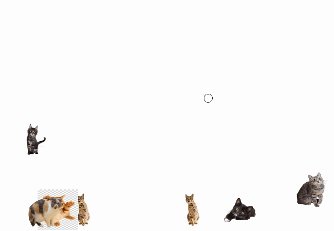
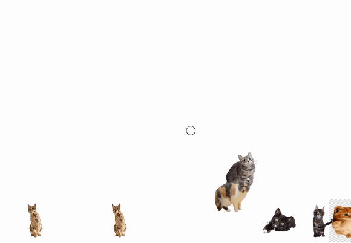
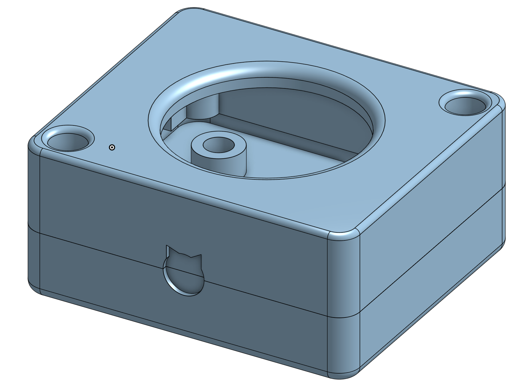

# Cat Toy Simulator
A “cat toy simulator” controlled by a physical joystick, button, and LILYGO ESP32

## Summary
This project is a “cat toy simulator”, where you use a physical joystick, button, and LILYGO ESP32 to interface with a computer running the simulation. Using the physical controls of the joystick and button, the player controls the cat toy on screen while trying to stay away from cats that are in chase. 
In this project, a LILYGO ESP32 T-Display is used to process inputs from the joystick and button and convert them into serial output. The code for doing so was written in the Arduino IDE. 
The serial output is then processed and turned into actions in the simulation on the computer screen. The code for doing so was written in Processing.
I also modified and 3D printed an enclosure for my joystick.

If you are interested in more of the design details and process behind creating the project, check out the writeup on [my website](https://davidjihwan.com/Cat-Toy-Simulator)

## Media
Gameplay:

Players can move around using the joystick:

Players can "jump" using the button:

Cats can grab the player, who can regain control by clicking the button:

## Materials
- [Arduino IDE](https://www.arduino.cc/en/software)
- [LILYGO ESP32 T-Display](https://www.lilygo.cc/products/lilygo%C2%AE-ttgo-t-display-1-14-inch-lcd-esp32-control-board?srsltid=AfmBOordft8S6UaQt1WnySrXgbTSEONV1JsxoCGzCaYUcaJFkpL_2dnz)
- USB-C cable
- Breadboard
- 5x: Male to female jumper wires
- 7x: Male to male jumper wires
- [Tactile Button](https://www.aliexpress.us/item/3256806107122384.html?spm=a2g0o.order_list.order_list_main.47.21ef1802q6HtRj&gatewayAdapt=glo2usa#nav-specification)
- [Joystick](TODO)

Optional (for the joystick enclosure):
- 3D printer
- 4x: M3-0.5 heat set inserts
- 2x: 3mm by 0.5mm screws
- 2x: 3mm by 20mm screws

## Quick Start Guide
Breadboard Setup:
1. Solder the pins that came with the ESP32 onto the board.
2. Insert the ESP-32 into the breadboard following the wiring diagram below.
3. Connect the pins following the wiring diagram below. Take note that the jumper wires connecting the joystick to the breadboard should be male to female wires.

Here's a Fritzig wiring diagram of the wiring for ths project. 
[TODO: Fritzig diagram]

Here's what your breadboard should look like:

General Installations:
1. Download the [Arduino IDE](https://www.arduino.cc/en/software) on your computer of choice.
2. Install the "TFT_eSPI" library by Bodmer and the "Adafruit GFX" library by Adafruit in the Arduino IDE using the library manager (Tools/Manage Libraries).
3. Open the file Arduino/libraries/TFT_eSPI/User_Setup_Select.h
4. Comment out the line #include <User_setup.h> and uncomment out the line include <User_Setups/Setup25_TTGO_T_Display.h>
5. Install the relevant [ESP32 Drivers](https://github.com/Xinyuan-LilyGO/TTGO-T-Display) (CH9102).

Project Installation and Setup:
1. Download the Arduino project file to write to serial output [here](Arduino/Cat_Toy_Serial/Cat_Toy_Serial.ino).
2. Open the project file.
3. Change your board: Tools > Boards > esp32 > ESP32 Dev Module
4. Change the port: Tools > Port > your-port (mac users should select “wchusb")
5. Plug the ESP32 into your computer.
6. Press the upload button (at the top left of the window) to upload your code to the ESP32. 
7. Download the Processing project file to read the serial output and write to the computer screen [here](Processing/Cat_Toy_Simulator/Cat_Toy_Simulator.pde).
8. Open the project file and hit run (at the top left of the window). The port corresponding to the ESP32 is hardcoded in the Processing sketch, and often isn’t the right one. Once you hit run, you’ll see a list of the currently available ports along with their corresponding numbers. Change the number of the port in the line “String portName = Serial.list()[NUMBER];” (near the top of setup()) to the one that corresponds to “wchusb”, and run the program again.
9. That's it! You should see the running Processing sketch, with the ESP32 now taking in inputs from the joystick and button reflected in the sketch. 

Optional Joystick Enclosure:

<a href="url">
1. Download the files for the joystick enclosure [TODO: here]
2. 3D print the top and bottom sections of the enclosure using your printer of choice. 
3. Insert the head inserts into the designated locations on the bottom section of the enclosure. [TODO: this] is a good tutorial for heat inserts.

<a href="url">

5. Place the joystick onto the bottom section of the enclosure such that the holes line up with the head inserts. Screw the joystick into place using the 3mm by 4?mm [TODO] screws

<a href="url">

7. Remove the cap of the joystick and place the top section of the enclosure onto the bottom section and joystick such that the holes on the top section line up with the heat inserts on the bottom section.
8. Screw the sections together using the 3mm by 7?mm [TODO] screws. Place the cap back onto the joystick.

## Troubleshooting
Here are a couple of common errors that I ran into while testing:
- Code quits with "Missing one or both inputs” written to the output. Often, this just seems to happen due to communication issues even if pins are seeded correctly, so try exiting the program and trying again a couple times. If the error persists, check that the pins are correctly seeded in the motherboard and joystick and try again. Check if the correct port is being used by looking at the output of the Sketch.
- Simulation runs but the circle representing the player is missing. This also seems to be a communication issue. Exit and try again.

General code troubleshooting: 
- The pin numbers corresponding to inputs are hardcoded in the Arduino sketch. Make sure that the pin numbers line up with those in your breadboard.
- If either the joystick or button does not lead to any response on screen, try printing the value of ‘val’, the serial output read from the ESP32 (near the top of the draw() function). The output should be in the format of [x, y, z | b], where *x* and *y* correspond to coordinates of the joystick, *z* is the value of the button inside the joystick, and *b* is the value of the button.

Enclosure troubleshooting:
- I found that the enclosure was a little tight for the joystick after I assembled it. I would suggest increasing the circular section that houses the moving part of the joystick by 5% or more for greater tolerance.
- The holes for pins in the top section of the enclosure may also be too small for some pins. Increasing the size of them would also help tolerance issues. Increasing the size of these holes greatly would not be much of a problem as the screws screw into the heat inserts on the bottom section of the enclosure.

## Credits
Cat Pictures:
- https://www.google.com/url?sa=i&url=https%3A%2F%2Fwww.deviantart.com%2Fanavrin-ai%2Fart%2FCat-Kitten-Isolated-On-Transparent-Background-7-965728225&psig=AOvVaw0wjowez13AuZsIqCFCP_U9&ust=1729562625831000&source=images&cd=vfe&opi=89978449&ved=0CBcQjhxqFwoTCJjgp4OxnokDFQAAAAAdAAAAABA9
- https://www.google.com/url?sa=i&url=https%3A%2F%2Fwww.deviantart.com%2Fanavrin-ai%2Fart%2FCat-Transparent-Background-PNG-3-947858321&psig=AOvVaw0wjowez13AuZsIqCFCP_U9&ust=1729562625831000&source=images&cd=vfe&opi=89978449&ved=0CBcQjhxqFwoTCJjgp4OxnokDFQAAAAAdAAAAABBC
- https://www.google.com/url?sa=i&url=https%3A%2F%2Fcommons.wikimedia.org%2Fwiki%2FFile%3AEUR_cat_transparent.png&psig=AOvVaw0wjowez13AuZsIqCFCP_U9&ust=1729562625831000&source=images&cd=vfe&opi=89978449&ved=0CBcQjhxqFwoTCJjgp4OxnokDFQAAAAAdAAAAABBL
-https://www.google.com/url?sa=i&url=https%3A%2F%2Fca.pinterest.com%2Fpin%2Forange-tabby-kitten-cute-cat-transparent-background-png-clipart--364369426114234340%2F&psig=AOvVaw0wjowez13AuZsIqCFCP_U9&ust=1729562625831000&source=images&cd=vfe&opi=89978449&ved=0CBcQjhxqFwoTCJjgp4OxnokDFQAAAAAdAAAAABBW
- https://www.google.com/url?sa=i&url=https%3A%2F%2Fcommons.wikimedia.org%2Fwiki%2FFile%3AExotic_cat_transparent.png&psig=AOvVaw0wjowez13AuZsIqCFCP_U9&ust=1729562625831000&source=images&cd=vfe&opi=89978449&ved=0CBcQjhxqFwoTCJjgp4OxnokDFQAAAAAdAAAAABBk
- https://www.google.com/url?sa=i&url=https%3A%2F%2Fwww.deviantart.com%2Fanavrin-ai%2Fart%2FCat-Kitten-Isolated-On-Transparent-Background-13-965728152&psig=AOvVaw0wjowez13AuZsIqCFCP_U9&ust=1729562625831000&source=images&cd=vfe&opi=89978449&ved=0CBcQjhxqFwoTCJjgp4OxnokDFQAAAAAdAAAAABBv

Original Enclosure Model:
https://github.com/ttseng/coms3930-joystick-enclosure/tree/main
